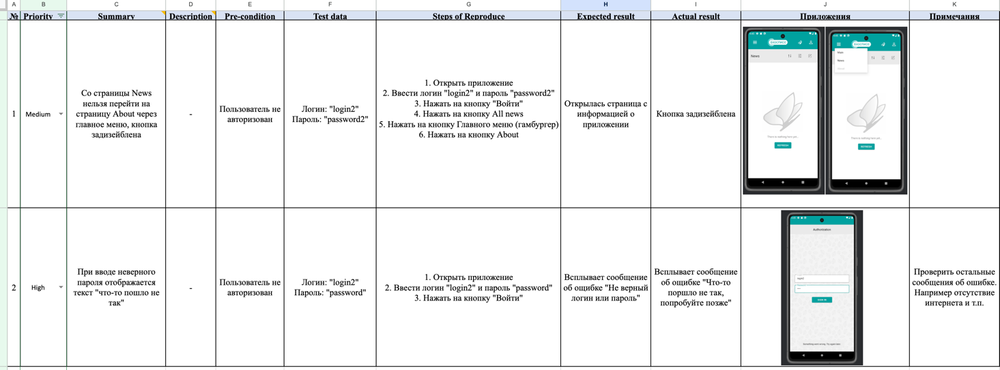
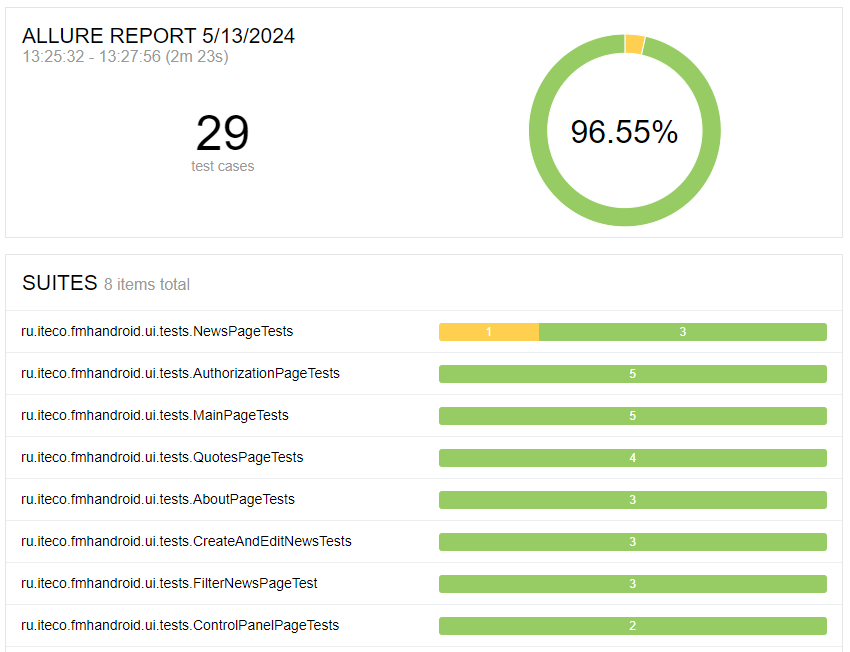

# Краткий отчет:

Было проведено ручное и автоматизированное тестирование приложения "Мобильный хоспис"
По [плану тестирования](Plan.md) было запланировано около 96 часов на тестирование. 
По факту ушло больше времени, которое было потрачено на разработку, доработку, рефакторинг, отладку автотестов.

По итогу написано 29 автотестов. На их создание и их рефакторинг ушло примерно 96 часов.

В результате тестирования были обнаружены проблемы с невозможностью перехода на страницу "О приложении" со страницы Новостей, 
и проблемы с отображением ошибок при вворде неверного логина или пароля. Заведены баг репорты. В корень проекта загружен allure отчет.
[BugsReport:](BugReports.xlsx)

[AllureReport:](allure-results.rar)

## По автотестам требуется доработка:
- перенос общих методов на страницу baseSteps (к общим методам относятся например навигация по приложению),
- доработка верной обработки ошибок при падении тестов,
- разбиение проверок на более мелкие(например в тестовом классе по созданию и редактированию новостей)
- создание новых тестов (еще достаточно много проверок которые можно автоматизировать).

## Сложности при выполнении тестирования:
- нехватка времени (совмещение с работой на основной работе)
- совместная работа над новостями с другими тестировщиками/студентами (новости иногда переименовывают или удаляют)
- знание языка и фраемворков (сложно с базовыми знаниями Java и основами ООП веб-тестирования перестроится на мобильное тестирование, которому в учебном процессе было посвящено поверхностно пару месяцев)
